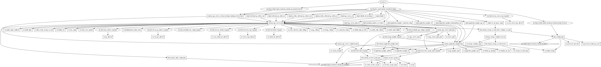

# Azure App Service (Web Apps) Terraform Module

Azure App Service is a fully managed web hosting service for building web apps, mobile back ends and RESTful APIs. This terraform module helps you create Azure App Service with optional site_config, backup, connection_string, auth_settings and Storage for mount points.

## Module Usage

```hcl
module "web-app" {
  source  = "kumarvna/web-app/azurerm"
  version = "1.0.0"

  # By default, this module will not create a resource group. Location will be same as existing RG.
  # proivde a name to use an existing resource group, specify the existing resource group name, 
  # set the argument to `create_resource_group = true` to create new resrouce group.
  resource_group_name = "rg-shared-westeurope-01"

  # App service plan setttings and supported arguments. Default name used by module
  # To specify custom name use `app_service_plan_name` with a valid name.  
  # for Service Plans, see https://azure.microsoft.com/en-us/pricing/details/app-service/windows/  
  # App Service Plan for `Free` or `Shared` Tiers `use_32_bit_worker_process` must be set to `true`.
  service_plan = {
    kind = "Windows"
    size = "P1v2"
    tier = "PremiumV2"
  }

  # App Service settings and supported arguments
  # Backup, connection_string, auth_settings, Storage for mounts are optional configuration
  app_service_name       = "mypocproject"
  enable_client_affinity = true

  # A `site_config` block to setup the application environment. 
  # Available built-in stacks (windows_fx_version) for web apps `az webapp list-runtimes`
  # Runtime stacks for Linux (linux_fx_version) based web apps `az webapp list-runtimes --linux`
  site_config = {
    always_on                 = true
    dotnet_framework_version  = "v2.0"
    ftps_state                = "FtpsOnly"
    managed_pipeline_mode     = "Integrated"
    use_32_bit_worker_process = true
    windows_fx_version        = "DOTNETCORE|2.1"
  }

  # (Optional) A key-value pair of Application Settings
  app_settings = {
    APPINSIGHTS_PROFILERFEATURE_VERSION             = "1.0.0"
    APPINSIGHTS_SNAPSHOTFEATURE_VERSION             = "1.0.0"
    DiagnosticServices_EXTENSION_VERSION            = "~3"
    InstrumentationEngine_EXTENSION_VERSION         = "disabled"
    SnapshotDebugger_EXTENSION_VERSION              = "disabled"
    XDT_MicrosoftApplicationInsights_BaseExtensions = "disabled"
    XDT_MicrosoftApplicationInsights_Java           = "1"
    XDT_MicrosoftApplicationInsights_Mode           = "recommended"
    XDT_MicrosoftApplicationInsights_NodeJS         = "1"
    XDT_MicrosoftApplicationInsights_PreemptSdk     = "disabled"
  }

  # The Backup feature in Azure App Service easily create app backups manually or on a schedule.
  # You can configure the backups to be retained up to an indefinite amount of time.
  # Azure storage account and container in the same subscription as the app that you want to back up. 
  # This module creates a Storage Container to keep the all backup items. 
  # Backup items - App configuration , File content, Database connected to your app
  enable_backup        = true
  storage_account_name = "stdiagfortesting"
  backup_settings = {
    enabled                  = true
    name                     = "DefaultBackup"
    frequency_interval       = 1
    frequency_unit           = "Day"
    retention_period_in_days = 90
  }

  # By default App Insight resource is created by this module. 
  # Specify valid resource Id to `application_insights_id` to use existing App Insight
  # Specifies the type of Application by setting up `application_insights_type` with valid string
  # Specifies the retention period in days using `retention_in_days`. Default 90.
  # By default the real client ip is masked in the logs, to enable set `disable_ip_masking` to `true` 
  app_insights_name = "otkpocshared"

  # Adding TAG's to your Azure resources 
  tags = {
    ProjectName  = "demo-internal"
    Env          = "dev"
    Owner        = "user@example.com"
    BusinessUnit = "CORP"
    ServiceClass = "Gold"
  }
}
```

## App Service Plan

An App Service plan defines a set of computing resources for a web app to run. These compute resources are analogous to the server farm in conventional web hosting. One or more apps can be configured to run on the same computing resources.

The pricing tier (`Free`, `Shared`, `Basic`, `Standard`, `Premium`, `PremiumV2`, `PremiumV3`, `Isolated`) of an App Service plan determines what App Service features you get and how much you pay for the plan. There are a few categories of pricing tiers:

- **Shared compute**: `Free` and `Shared`, the two base tiers, runs an app on the same Azure VM as other App Service apps, including apps of other customers. These tiers allocate CPU quotas to each app that runs on the shared resources, and the resources cannot scale out.
- **Dedicated compute**: The Basic, Standard, Premium, PremiumV2, and PremiumV3 tiers run apps on dedicated Azure VMs. Only apps in the same App Service plan share the same compute resources. The higher the tier, the more VM instances are available to you for scale-out.
- **Isolated**: This tier runs dedicated Azure VMs on dedicated Azure Virtual Networks. It provides network isolation on top of compute isolation to your apps. It provides the maximum scale-out capabilities.

The `**service_paln**` object accept following keys:

| Name | Description
|--|--
kind|The kind of the App Service Plan to create. Possible values are `Windows` (also available as App), `Linux`, `elastic`(for Premium Consumption) and `FunctionApp` (for a Consumption Plan)
size|Size specifier of the resource SKU. Available sizes are F1(Free), D1(Shared), B1(Basic Small), B2(Basic Medium), B3(Basic Large), S1(Standard Small), P1V2(Premium V2 Small), P1V3(Premium V3 Small), P2V3(Premium V3 Medium), P3V3(Premium V3 Large), PC2 (Premium Container Small), PC3 (Premium Container Medium), PC4 (Premium Container Large), I1 (Isolated Small), I2 (Isolated Medium), I3 (Isolated Large), I1v2 (Isolated V2 Small), I2v2 (Isolated V2 Medium), I3v2 (Isolated V2 Large). Valid accepted values are: `B1`, `B2`, `B3`, `D1`, `F1`, `FREE`, `I1`, `I1v2`, `I2`, `I2v2`, `I3`, `I3v2`, `P1V2`, `P1V3`, `P2V2`, `P2V3`, `P3V2`, `P3V3`, `PC2`, `PC3`, `PC4`, `S1`, `S2`, `S3`, `SHARED`
capacity|Specifies the number of workers associated with this App Service Plan.|number|`1`
tier|Specifies the plan's pricing tier. Valid option are `Free`, `Shared`, `Basic`, `Standard`, `PremiumV2` and `Isolated`
per_site_scaling| Can Apps assigned to this App Service Plan be scaled independently? If set to false apps assigned to this plan will scale to all instances of the plan

## App Service general settings - `Site_Config`

`site_config` block helps you setup the application environment and accept following Keys
| Name | Description
|--|--
always_on|Should the app be loaded at all times? Defaults to `false`
app_command_line| App command line to launch, e.g. /sbin/myserver -b 0.0.0.0.
default_documents|The ordering of default documents to load, if an address isn't specified.
dotnet_framework_version|The version of the .net framework's CLR used in this App Service. Possible values are `v2.0` (which will use the latest version of the .net framework for the .net CLR v2 - currently `.net 3.5`), `v4.0` (which corresponds to the latest version of the .net CLR v4 - which at the time of writing is `.net 4.7.1`) and `v5.0`. [For more information on which .net CLR version to use based on the .net framework you're targeting - please see this table](https://en.wikipedia.org/wiki/.NET_Framework_version_history#Overview). Defaults to `v4.0`.
ftps_state|State of FTP / FTPS service for this App Service. Possible values include: `AllAllowed`, `FtpsOnly` and `Disabled`. Defaults to `FtpsOnly`
health_check_path|The health check path to be pinged by App Service. For more information - [please see App Service health check announcement](https://azure.github.io/AppService/2020/08/24/healthcheck-on-app-service.html).
number_of_workers|The scaled number of workers (for per site scaling) of this App Service. Requires that `per_site_scaling` is enabled on the `azurerm_app_service_plan`. [For more information - please see Microsoft documentation on high-density hosting](https://docs.microsoft.com/en-us/azure/app-service/manage-scale-per-app).
http2_enabled|Is HTTP2 Enabled on this App Service? Defaults to `false`.
ip_restriction|A List of objects representing ip restrictions. User has to explicitly set `ip_restriction` to empty slice `( [] )` to remove it.
scm_use_main_ip_restriction|IP security restrictions for scm to use main. Defaults to `false`. Any `scm_ip_restriction` blocks configured are ignored by the service when `scm_use_main_ip_restriction` is set to `true`. Any scm restrictions will become active if this is subsequently set to `false` or removed
scm_ip_restriction|A List of objects representing ip restrictions. User has to explicitly set `ip_restriction` to empty slice `( [] )` to remove it.
java_container|The Java Container to use. If specified `java_version` and `java_container_version` must also be specified. Possible values are `JAVA`, `JETTY`, and `TOMCAT`.
java_container_version|The version of the Java Container to use. If specified `java_version` and `java_container` must also be specified.
java_version| The version of Java to use. If specified `java_container` and `java_container_version` must also be specified. Possible values are `1.7`, `1.8` and `11` and their specific versions - except for Java 11 (e.g. `1.7.0_80`, `1.8.0_181`, `11`)
local_mysql_enabled|Is "MySQL In App" Enabled? This runs a local MySQL instance with your app and shares resources from the App Service plan. **MySQL In App is not intended for production environments and will not scale beyond a single instance. Instead you may wish to use [Azure Database for MySQL](https://registry.terraform.io/providers/hashicorp/azurerm/latest/docs/resources/mysql_database).**
linux_fx_version|Linux App Framework and version for the App Service. Possible options are a Docker container `(DOCKER|<user/image:tag>)`, a base-64 encoded Docker Compose file `(COMPOSE|${filebase64("compose.yml")})` or a base-64 encoded Kubernetes Manifest `(KUBE|${filebase64("kubernetes.yml")})`. To find runtime stacks for Linux (`linux_fx_version`) based web apps run `az webapp list-runtimes --linux`. To set this property the App Service Plan to which the App belongs must be configured with `kind = "Linux"`, and `reserved = true` or the API will reject any value supplied.
windows_fx_version| (Optional) The Windows Docker container image `(DOCKER|<user/image:tag>)`. To find built-in stacks (windows_fx_version) for web apps run `az webapp list-runtimes`.
managed_pipeline_mode|The Managed Pipeline Mode. Possible values are `Integrated` and `Classic`. Defaults to `Integrated`
min_tls_version|The minimum supported TLS version for the app service. Possible values are `1.0`, `1.1`, and `1.2`. Defaults to `1.2` for new app services.
php_version|The version of PHP to use in this App Service. Possible values are `5.5`, `5.6`, `7.0`, `7.1`, `7.2`, `7.3` and `7.4`.
python_version|The version of Python to use in this App Service. Possible values are `2.7` and `3.4`.
remote_debugging_enabled|Is Remote Debugging Enabled? Defaults to `false`.
remote_debugging_version|Which version of Visual Studio should the Remote Debugger be compatible with? Possible values are `VS2012`, `VS2013`, `VS2015` and `VS2017`.
scm_type|The type of Source Control enabled for this App Service. Defaults to `None`. Possible values are: `BitbucketGit`, `BitbucketHg`, `CodePlexGit`, `CodePlexHg`, `Dropbox`, `ExternalGit`, `ExternalHg`, `GitHub`, `LocalGit`, `None`, `OneDrive`, `Tfs`, `VSO`, and `VSTSRM`
use_32_bit_worker_process| Should the App Service run in 32 bit mode, rather than 64 bit mode? **when using an App Service Plan in the `Free` or `Shared` Tiers `use_32_bit_worker_process` must be set to `true`.**
websockets_enabled|Should WebSockets be enabled?

### A `cors` block - part of `site_config` supports the following:

Since App Service CORS lets you specify one set of accepted origins for all API routes and methods, you would want to use your own CORS code. See how ASP.NET Core does it at Enabling Cross-Origin Requests (CORS). Don't try to use App Service CORS and your own CORS code together. 
| Name | Description
|--|--
allowed_origins|A list of origins which should be able to make cross-origin calls. `*` can be used to allow all calls.
support_credentials|Are credentials supported?

## `auth_settings` - Authentication and authorization in Azure App Service

Azure App Service provides built-in authentication and authorization capabilities (sometimes referred to as "Easy Auth"), so you can sign in users and access data by writing minimal or no code in your web app, RESTful API, and mobile back end, and also Azure Functions. 

App Service uses federated identity, in which a third-party identity provider manages the user identities and authentication flow for you.  `Microsoft Identity Platform`, `Facebook`, `Google`, `Twitter`, Any `OpenID Connect` Provider are available by default.  

This Module support `Azure Active Directory Integration` and needs following keys.

| Name | Description
|--|--
client_id|The Client ID of this relying party application. Enables OpenIDConnection authentication with Azure Active Directory.
client_secret|The Client Secret of this relying party application. If no secret is provided, implicit flow will be used.
allowed_audiences| Allowed audience values to consider when validating JSON Web Tokens issued by Azure Active Directory.

## `backup` - Backup and Restore feature in Azure App Service

The Backup and Restore feature in Azure App Service lets you easily create app backups manually or on a schedule. You can configure the backups to be retained up to an indefinite amount of time. You can restore the app to a snapshot of a previous state by overwriting the existing app or restoring to another app. 

### What gets backed up

- App configuration
- File content
- Database connected to your app

### Requirements and restrictions

- The Backup and Restore feature requires the App Service plan to be in the `Standard`, `Premium` or `Isolated`. `**Premium**` and `**Isolated**` tiers allow a greater number of daily back ups than `Standard` tier.
- You need an Azure storage account and container in the same subscription as the app that you want to back up. 
- Backups can be up to 10 GB of app and database content. If the backup size exceeds this limit, you get an error.
- Backups of TLS enabled Azure Database for MySQL is not supported.
- Backups of TLS enabled Azure Database for PostgreSQL is not supported.
- In-app MySQL databases are automatically backed up without any configuration. If you make manually settings for in-app MySQL databases, such as adding connection strings, the backups may not work correctly.
- Using a firewall enabled storage account as the destination for your backups is not supported.
- Currently, you can't use the Backup and Restore feature with the Azure App Service VNet Integration feature.
- Currently, you can't use the Backup and Restore feature with Azure storage accounts that are configured to use Private Endpoint.

> Each backup is a complete offline copy of your app, not an incremental update.

`backup` object accepct following keys:
| Name | Description
|--|--
enable_backup | condition to enable backup functionality to this module and can be enabled by setting up the variable `enable_backup = true`. Defaults to `false`
name|Specifies the name for this Backup.
enabled|Is backup enabled? Depends on `enable_backup` variable
storage_account_url|The SAS URL to a Storage Container where Backups should be saved.
frequency_interval|Sets how often the backup should be executed.
frequency_unit|Sets the unit of time for how often the backup should be executed. Possible values are `Day` or `Hour`.
retention_period_in_days|Specifies the number of days after which Backups should be deleted.
start_time|Sets when the schedule should start working


## Recommended naming and tagging conventions

Applying tags to your Azure resources, resource groups, and subscriptions to logically organize them into a taxonomy. Each tag consists of a name and a value pair. For example, you can apply the name `Environment` and the value `Production` to all the resources in production.
For recommendations on how to implement a tagging strategy, see Resource naming and tagging decision guide.

> **Important** :
Tag names are case-insensitive for operations. A tag with a tag name, regardless of the casing, is updated or retrieved. However, the resource provider might keep the casing you provide for the tag name. You'll see that casing in cost reports. **Tag values are case-sensitive.**

An effective naming convention assembles resource names by using important resource information as parts of a resource's name. For example, using these [recommended naming conventions](https://docs.microsoft.com/en-us/azure/cloud-adoption-framework/ready/azure-best-practices/naming-and-tagging#example-names), a public IP resource for a production SharePoint workload is named like this: `pip-sharepoint-prod-westus-001`.

## Requirements

| Name      | Version   |
| --------- | --------- |
| terraform | >= 0.13   |
| azurerm   | >= 2.59.0 |

## Providers

| Name    | Version   |
| ------- | --------- |
| azurerm | >= 2.59.0 |

## Inputs

| Name | Description | Type | Default |
|--|--|--|--|
`create_resource_group` | Whether to create resource group and use it for all networking resources | string | `"false"`
`resource_group_name` | The name of the resource group in which resources are created | string | `""`
`location` | The location of the resource group in which resources are created | string | `""`
`app_service_plan_name` | Specifies the name of the App Service Plan component | string | `""`
`service_plan` | Definition of the dedicated plan to use | object({}) | `{}`
`app_service_name` | Specifies the name of the App Service | string | `""`
`app_settings` | A key-value pair of App Settings | map(string) | `{}`
`site_config` | Site configuration for Application Service | any | `{}`
`ips_allowed` | IPs restriction for App Service to allow specific IP addresses or ranges | list(string) | `[]`
`subnet_ids_allowed` | Allow Specific Subnets for App Service | list(string) | `[]`
`service_tags_allowed` | Restrict Service Tags for App Service | list(string) | `[]`
`scm_ips_allowed` | SCM IP restrictions for App service | list(string) | `[]`
`scm_subnet_ids_allowed` | Restrict SCM Subnets for App Service | list(string) | `[]`
`scm_service_tags_allowed` | Restrict SCM Service Tags for App Service | list(string) | `[]`
`enable_auth_settings` | Specifies the Authenication enabled or not | string | `false`
`default_auth_provider` | The default provider to use when multiple providers have been set up. Possible values are `AzureActiveDirectory`, `Facebook`, `Google`, `MicrosoftAccount` and `Twitter`" | string | `"AzureActiveDirectory"`
`unauthenticated_client_action` | The action to take when an unauthenticated client attempts to access the app. Possible values are `AllowAnonymous` and `RedirectToLoginPage` |string | `"RedirectToLoginPage"`
`token_store_enabled` | If enabled the module will durably store platform-specific security tokens that are obtained during login flows | string | `false`
`active_directory_auth_setttings` | Acitve directory authentication provider settings for app service | any | `{}`
`enable_client_affinity` | Should the App Service send session affinity cookies, which route client requests in the same session to the same instance? | string | `false`
`enable_client_certificate` | Does the App Service require client certificates for incoming requests | string | `false`
`enable_https` | Can the App Service only be accessed via HTTPS? | string | `false`
`enable_backup` | bool to to setup backup for app service | string | `false`
`backup_settings` | Backup settings for App service | object({}) | `{}`
`connection_strings` | Connection strings for App Service | list(map(string)) | `[]`
`identity_ids` | Specifies a list of user managed identity ids to be assigned | string | `null`
`storage_mounts` | Storage account mount points for App Service | list(map(string)) | `[]`
`custom_domains` | Custom domains with SSL binding and SSL certificates for the App Service. Getting the SSL certificate from an Azure Keyvault Certificate Secret or a file is possible | map(map(string)) | `null`
`application_insights_enabled` | Specify the Application Insights use for this App Service | string | `true`
`application_insights_id` | Resource ID of the existing Application Insights | string | `null`
`app_insights_name` | The Name of the application insights | string | `""`
`application_insights_type` | Specifies the type of Application Insights to create. Valid values are `ios` for iOS, `java` for Java web, `MobileCenter` for App Center, `Node.JS` for Node.js, `other` for General, `phone` for Windows Phone, `store` for Windows Store and `web` for ASP.NET | string | `"web"`
`retention_in_days` | Specifies the retention period in days. Possible values are `30`, `60`, `90`, `120`, `180`, `270`, `365`, `550` or `730` | number | `90`
`disable_ip_masking` | By default the real client ip is masked as `0.0.0.0` in the logs. Use this argument to disable masking and log the real client ip | string | `false`
`Tags` | A map of tags to add to all resources | map | `{}`

## Outputs

| Name | Description |
|--|--|
`app_service_plan_id` | The resource ID of the App Service Plan component
`maximum_number_of_workers` | The maximum number of workers supported with the App Service Plan's sku
`app_service_id` | The resource ID of the App Service component
`default_site_hostname` | The Default Hostname associated with the App Service
`outbound_ip_addresses` | A comma separated list of outbound IP addresses
`outbound_ip_address_list` | A list of outbound IP addresses
`possible_outbound_ip_addresses` | A comma separated list of outbound IP addresses - not all of which are necessarily in use. Superset of `outbound_ip_addresses`.
`possible_outbound_ip_address_list` | A list of outbound IP addresses - not all of which are necessarily in use. Superset of `outbound_ip_address_list`
`identity` | An identity block, which contains the Managed Service Identity information for this App Service
`application_insights_id` | The ID of the Application Insights component
`application_insights_app_id` | The App ID associated with this Application Insights component
`application_insights_instrumentation_key` | The Instrumentation Key for this Application Insights component
`application_insights_connection_string` | The Connection String for this Application Insights component

## Resource Graph



## Authors

Originally created by [Kumaraswamy Vithanala](mailto:kumarvna@gmail.com)

## Other resources

- [App Service(Web Apps)](https://docs.microsoft.com/en-us/azure/app-service/)
- [Terraform AzureRM Provider Documentation](https://www.terraform.io/docs/providers/azurerm/index.html)

```

```
